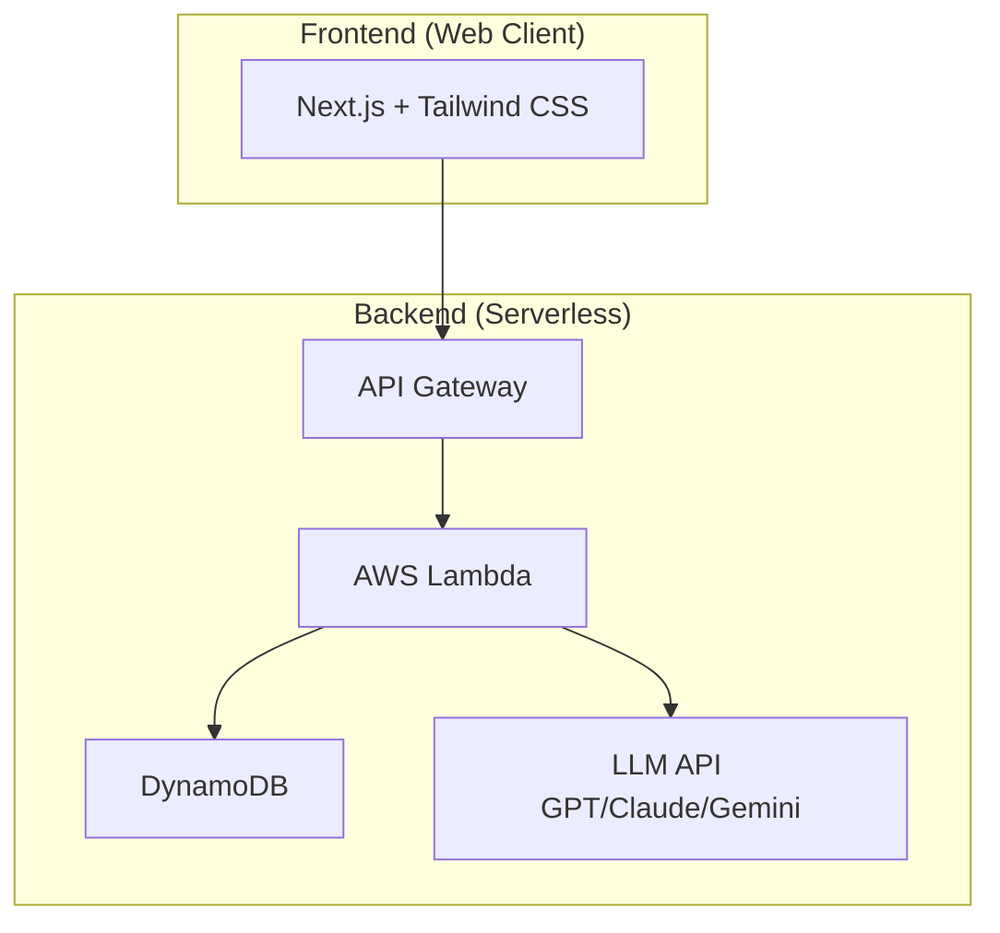
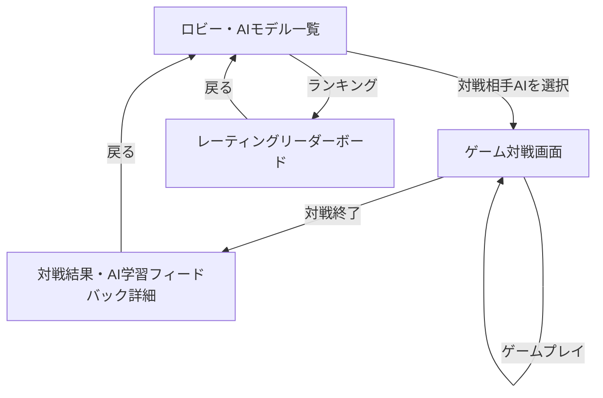

# Electric Chair Arena

## 概要

Electric Chair Arena は、水曜日のダウンタウンで放送された「電気イスゲーム」を再現し、人間プレイヤーが多彩な特徴を持つAIモデルと対戦し、その戦績を通じてAIモデルが学習・成長していくことを目的としたプロジェクトです。

人間対AIの駆け引きや心理戦をWeb上で楽しむことができると同時に、対戦結果や行動ログをフィードバックすることで、AIモデルが段階的により強力な戦術を身につけていく仕組みを提供します。

最終的には、

* 岡野陽一風AI
* 小籔千豊風AI
* 千原ジュニア風AI
* LLM（GPT、Claude、Gemini）ベースAI
* 学習・成長型AI（対戦ログからプレイヤーの癖やセオリーを学習）

などを実装し、人間との対戦を繰り返して最強に育つ電気イスゲームAIの開発を目指します。

---

# プロジェクトの目的

本プロジェクトは単なるゲーム再現ではなく、以下を目的としています。

* 電気イスゲームのルールをプログラムで高精度に再現する
* 人間プレイヤーが任意のAIモデル（対戦相手）を選択していつでも遊べる環境の提供
* 人間とAIの対戦データを蓄積・解析する
* 勝敗結果からAIモデルのELOレーティング、勝率を算出・評価する
* 戦績や行動傾向をフィードバックし、AIのゲーム戦略を継続的に強化・成長させる

---

# 電気イスゲームとは

電気イスゲームは、水曜日のダウンタウンで放送された心理戦ゲームです。

プレイヤーは複数のイスの中から座るイスを選択します。

一部のイスには電流が仕掛けられており、電流が流れたイスを選ぶと失点（ライフ減少）となります。

プレイヤーは、

* 相手の思考を読む
* 安全そうなイスを選ぶ
* あえて危険な選択をする
* ブラフをかける

といった駆け引きを行います。

運だけでなく心理戦や読み合いが勝敗を左右することが特徴です。

---

# 本プロジェクトで再現するルール

※実際の番組ルールを参考にしつつ、Webゲーム向けに調整しています。

## 基本ルール

* **プレイヤー数**：2名（人間 vs 選択したAIモデル）
* **イスの配置**：イスは1〜12まで時計の形（円状）に並んでいる
* **勝利条件**：40点先取（先に40点以上に達したプレイヤーが勝利）
* **敗北条件**：3回電気を喰らう（感電する）と負け。**また、電気を喰らうとそれまでのスコアは0にリセットされます。**
* **ゲーム終了条件**：
  * どちらかのプレイヤーが40点先取する
  * どちらかのプレイヤーが3回電気を喰らい、敗北が決定する
  * 最後に椅子が1つになったらゲーム終了（残った椅子が1つになった場合、その時点でゲーム終了。その時点での獲得スコア、または感電回数で勝敗を判定）
* 一部のイスには電流が設定される
* プレイヤーは順番にイスを選択する
* 感電するとスコアが0点にリセット、およびライフ減少（感電回数カウントアップ）

## AI向け追加ルール

* ゲーム状態をJSONで管理
* 全ターンの行動履歴を保存
* AIはゲーム状態および直前の対戦傾向を参照可能
* AIの意思決定プロセスや思考過程（Reasoning）の記録を任意で保存

---

# システム構成

```text
Human Player ───┐
                ├─→ Game Engine ─→ Battle Result ─→ AI Learning (Feedback Loop)
Selected AI ────┘
```

## System Architecture



## Screen Transitions



## Tech Stack

| 技術 | 名称 | 説明 |
| :---: | :--- | :--- |
|  | **Next.js** | フロントエンドのReactフレームワーク。App Routerを使用。 |
|  | **React** | ユーザーインターフェース構築のためのJavaScriptライブラリ。最新のv19を使用。 |
|  | **Tailwind CSS** | ユーティリティファーストのCSSフレームワーク。 |
|  | **DynamoDB** | フルマネージドなNoSQLデータベース。AIモデルの学習データ、戦績、レーティング、対戦履歴を格納。 |
|  | **AWS Lambda** | サーバーレスなイベント駆動型コンピューティングサービス。ゲームエンジンおよびAI学習エンジンをホスト。 |
|  | **Serverless Framework** | サーバーレスアプリケーションの構成・デプロイを管理するフレームワーク。 |
|  | **Vitest** | Viteネイティブで高速なユニットテストフレームワーク。 |
|  | **GitHub Actions** | CI/CD（継続的インテグレーション/継続的デプロイ）を自動化。 |

---

# AIプレイヤー（対戦モデル）

## Random AI

完全ランダムに行動するベースラインAI

## Rule Based AI

ルールやヒューリスティック（得点効率、安全度等）に基づいて行動するAI

## Personality AI

特定プレイヤーの特徴（ブラフ多め、安全志向など）を再現するAI

* 岡野AI
* 小籔AI
* ジュニアAI

## LLM AI

大規模言語モデルを利用し、コンテキスト理解や高度な心理戦を再現するAI

* GPT
* Claude
* Gemini

## Learning AI (成長型)

人間との実際の対戦ログ（どのような局面でどの椅子を選んだか、どこに電流を仕掛けたか）から傾向を学習し、徐々に対策戦術を最適化・強化するAI

---

# Backend API (AWS Lambda)

| 関数名 | パス | メソッド | 説明 |
| :--- | :--- | :--- | :--- |
| getPlayers | `/get-players` | GET | 選択可能なAIモデルの一覧と、現在のレーティング・戦績を取得する。 |
| getLeaderboard | `/get-leaderboard` | GET | AIモデルの現在のELOレーティングランキング一覧を取得する。 |
| getAiMove | `/ai-move` | POST | 指定したAIプレイヤーの1手（電流の設置 or 座る椅子の選択）を返す。人間対AI戦・ローカルPVP戦のフロントエンドから毎ターン呼び出される。 |
| saveMatch | `/save-match` | POST | 人間対AI戦・ローカルPVP戦の対戦結果とターン履歴を保存する。対AI戦の場合はELOレーティングを更新する。 |
| getMatches | `/get-matches` | GET | 保存済みの対戦履歴一覧を取得する。 |
| getMatchResult | `/get-match-result` | GET | `matchId` を指定して、特定の対戦結果の詳細を取得する。 |
| startMatch | `/start-match` | POST | 指定した2プレイヤー（AI同士）の対戦をサーバー側で最初から最後まで一括シミュレートし、結果・全ターンログ・レーティング変動を返す。 |
| generateCommentary | `/generate-commentary` | POST | Gemini APIを用いて直前のターンの実況コメンタリーを生成する（未設定・失敗時はモック文言にフォールバック）。 |

---

# Database (DynamoDB)

#### 1. players
AIモデルを格納するテーブル。レーティングや戦績を保持する。

| 属性名 | 型 | キー | 説明 |
| :--- | :--- | :--- | :--- |
| playerId | String | Partition Key | プレイヤーの一意識別子 |
| name | String | - | AIモデル名 |
| type | String | - | プレイヤータイプ（random, rule_based, personality, nash 等） |
| rating | Number | - | ELOレーティング（初期値1500） |
| winCount | Number | - | 勝利数 |
| matchCount | Number | - | 対戦数（敗北数は `matchCount - winCount` で算出） |
| updatedAt | String | - | 更新日時 (ISO8601) |

#### 2. matches
対戦結果と、各ターンの詳細ログを格納するテーブル。

| 属性名 | 型 | キー | 説明 |
| :--- | :--- | :--- | :--- |
| matchId | String | Partition Key | 対戦の一意識別子 (UUID) |
| player1Id | String | - | プレイヤー1のID（人間の場合は `"human"`、ローカルPVPの場合は `"p1"`/`"p2"`） |
| player2Id | String | - | プレイヤー2のID |
| mode | String | - | 対戦モード（`human` または `pvp`）。省略された旧データはmatchIdの命名から推測される |
| scores | Map | - | 最終得点 (p1, p2) |
| shocks | Map | - | 最終感電回数 (p1, p2) |
| winnerId | String | - | 勝利したプレイヤーのID（引き分けは `"draw"`） |
| ratingDiff | Number | - | この試合によるAIモデルのレーティング変動幅（絶対値） |
| logs | List/JSON | - | 各ターンの行動、感電有無、思考（Reasoning）の履歴 |
| createdAt | String | - | 対戦日時 (ISO8601) |

※ 対戦ログからAIが自動でプレイ傾向を学習・成長する仕組み（`weights` によるパラメーター最適化等）は未実装で、「将来構想」セクションのFeedback Loopとして構想段階です。

---

# 評価・学習指標

## 勝率
人間プレイヤーに対するAIモデルの勝率。

```text
AI勝利数 / 人間との総試合数
```

## ELOレーティング
人間プレイヤーを1500の基準とし、対戦を繰り返すことでAIモデルの強さを数値化。

## 行動パラメーターの最適化（将来構想・未実装）
対戦結果とターン履歴を基に、AIが「何点目の椅子に電流をセットされやすいか」「相手が何点目の椅子を好んで選ぶか」の確率テーブルを学習・更新する構想。現時点ではレーティング更新と対戦ログの保存のみが実装されている。

---

# CI/CD とデプロイ

## GitHub Pages へのデプロイ設定
本プロジェクトのフロントエンドは、GitHub Actions の CD ワークフロー（`cd.yml`）により `gh-pages` ブランチを介して GitHub Pages へデプロイされます。`main` ブランチへの変更がプッシュされると、フロントエンドのビルド成果物（`out/`）が自動的に `gh-pages` ブランチにプッシュされます。

デプロイ後にサイトが表示されない、またはエラーが発生する場合は、以下の設定を確認してください。

1. GitHub のリポジトリページを開きます。
2. **Settings** タブをクリックします。
3. 左側のサイドバーから **Pages** を選択します。
4. **Build and deployment** セクションの **Source** が **Deploy from a branch** に設定されていることを確認します。
5. **Branch** 設定で、デプロイ元のブランチとして **`gh-pages`** （フォルダは `/ (root)`）が選択されていることを確認します。
   ※ `gh-pages` ブランチは初回デプロイ実行（`main` ブランチへのプッシュ）により自動的に作成されます。

### リモートでCSSやJavaScriptなどのアセットが読み込めない（スタイルが崩れる・動かない）場合の対策
GitHub Pages（またはカスタムのサブディレクトリを持つ環境）にデプロイした際、「ローカル環境ではCSSやJSが効いているが、リモートにデプロイするとCSSが適用されず画面が崩れる」という現象が頻発することがあります。

#### 原因
Next.jsを静的エクスポート（`output: 'export'`）し、サブディレクトリ配下（GitHub Pagesの `https://<username>.github.io/<repository-name>/` など）にホストする場合、静的アセットへのパス（`/` で始まる絶対パス）にサブディレクトリ名が含まれていないとブラウザがファイルを読み込めず、404エラーとなります。

#### 対策と再発防止策
本プロジェクトでは、リポジトリの変更やフォークに対応するため、`frontend/next.config.mjs` にてビルド環境（GitHub Actions）の環境変数からリポジトリ名を自動抽出し、`basePath` および `assetPrefix` に設定する動的解決の仕組みを導入しています。

```javascript
const isGithubActions = process.env.GITHUB_ACTIONS === 'true';
const repoName = isGithubActions ? process.env.GITHUB_REPOSITORY.split('/')[1] : '';

/** @type {import('next').NextConfig} */
const nextConfig = {
  output: 'export',
  basePath: isGithubActions ? `/${repoName}` : '',
  assetPrefix: isGithubActions ? `/${repoName}/` : '',
  // ...
};
```

この設定により、リポジトリ名の変更や他ユーザーによるフォークが行われても、自動的に追従して適切なパスでビルドされます。

#### トラブルシューティング
上記設定を行ってもアセットの読み込みに失敗する場合、以下の項目を確認してください。
1. **GitHub Actions の環境変数確認**: Build ジョブで `GITHUB_REPOSITORY` 環境変数が渡されているか確認します（GitHub Actions の標準環境変数なので、標準構成であれば自動で設定されます）。
2. **アセットURL of 確認**: ブラウザの開発者ツール（F12）の `Console` または `Network` タブを開き、読み込みに失敗しているCSSやJSのURL（例: `https://<username>.github.io/Electric-Chair-Arena/_next/static/...`）が、実際のリポジトリ名と一致しているか確認してください。もし不一致がある場合は、`frontend/next.config.mjs` 内の `repoName` が適切に評価されているかをデバッグしてください。

---

# 運用

## バックアップと復旧

本システムでは、データの保護と可用性向上のため、以下のバックアップ体制をとっています。

- **DynamoDB Point-in-Time Recovery (PITR)**:
  - すべてのテーブル（`players`, `matches`）において PITR を有効化しています。
  - 過去 35 日間の任意の時点にデータを復旧することが可能です。

## AIモデル情報の初期セットアップ

ゲーム内に登場するデフォルトのAIモデル情報は、以下の手順で初期セットアップできます。

1. `backend/seed.js` を実行し、既定のAIモデル（`backend/seedData.js` に定義）をDynamoDBへ投入します（既存データは上書きしません）。
2. 開発環境ではローカルの DynamoDB（`serverless-dynamodb-local` プラグインによるインメモリのエミュレーション、`sls dynamodb start`）に対して手動で実行します。本番環境（DynamoDB）へは、CDワークフロー（`cd.yml`）のバックエンドデプロイ時に自動実行されます。

---

# 将来構想

## Phase 1

* ゲームルール実装
* 人間対AIモデルの対戦環境構築

## Phase 2

* 戦績保存とELOレーティングの自動計算
* 対戦ログからAIがプレイ傾向を学習・成長するFeedback Loopの実装

## Phase 3

* LLMプレイヤー（GPT, Claude, Gemini）を利用した高度な心理戦対戦相手の実装
* プレイヤーのプレイスタイルに合わせたパーソナライズ学習

## Phase 4

* Web UIの円形・時計状のインタラクティブなアニメーション表現のブラッシュアップ
* AIの学習成長過程を視覚化するダッシュボード画面

---

# ライセンス

本プロジェクトは非公式のファンプロジェクトです。

番組および関連コンテンツの権利は各権利者に帰属します。
