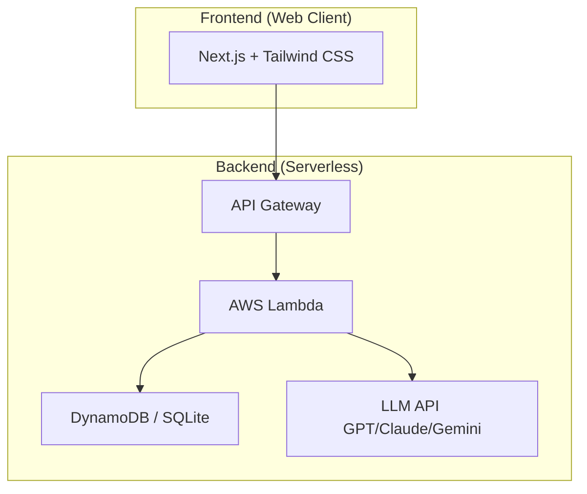
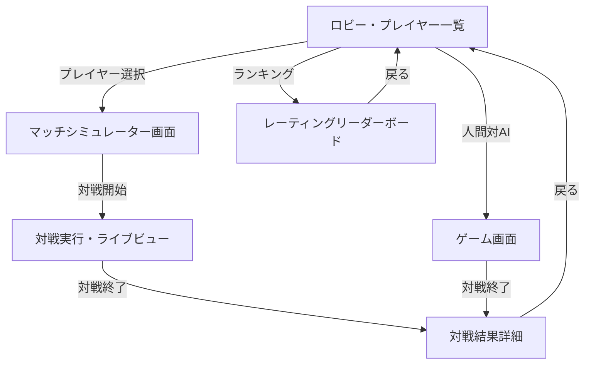

# Electric Chair Arena

## 概要

Electric Chair Arena は、水曜日のダウンタウンで放送された「電気イスゲーム」を再現し、AIプレイヤーの対戦・学習・評価を行うプロジェクトです。

ゲームエンジン上でAI同士を対戦させ、対戦ログや戦績を蓄積しながら戦略を改善します。

最終的には、

* 岡野陽一風AI
* 小籔千豊風AI
* 千原ジュニア風AI
* LLM（GPT、Claude、Gemini）ベースAI
* 強化学習AI

などを実装し、最強の電気イスゲームAIを育成することを目指します。

---

# プロジェクトの目的

本プロジェクトは単なるゲーム再現ではなく、以下を目的としています。

* 電気イスゲームのルールをプログラムで再現する
* AIプレイヤー同士の大量対戦を実施する
* 戦績データを蓄積する
* 勝率やレーティングを評価する
* 強い戦略を学習する
* 人間対AI対戦を実現する

---

# 電気イスゲームとは

電気イスゲームは、水曜日のダウンタウンで放送された心理戦ゲームです。

プレイヤーは複数のイスの中から座るイスを選択します。

一部のイスには電流が仕掛けられており、電流が流れたイスを選ぶと失点となります。

プレイヤーは、

* 相手の思考を読む
* 安全そうなイスを選ぶ
* あえて危険な選択をする
* ブラフをかける

といった駆け引きを行います。

運だけでなく心理戦や読み合いが勝敗を左右することが特徴です。

---

# 本プロジェクトで再現するルール

※実際の番組ルールを参考にしつつ、AI対戦向けに調整する場合があります。

## 基本ルール

* プレイヤー数：2名
* 複数のイスが存在する
* 一部のイスには電流が設定される
* プレイヤーは順番にイスを選択する
* 感電すると失点
* 規定スコアに到達したプレイヤーが勝利

## AI向け追加ルール

* ゲーム状態をJSONで管理
* 全ターンの行動履歴を保存
* AIはゲーム状態のみを参照可能
* 思考過程（Reasoning）の記録を任意で保存

---

# システム構成

```text
Player
   ↓
Game Engine
   ↓
Match Simulator
   ↓
Battle Result
   ↓
Rating System
```

## System Architecture



## Screen Transitions



## Tech Stack

| 技術 | 名称 | 説明 |
| :---: | :--- | :--- |
|  | **Next.js** | フロントエンドのReactフレームワーク。App Routerを使用。 |
|  | **React** | ユーザーインターフェース構築のためのJavaScriptライブラリ。最新のv19を使用。 |
|  | **Tailwind CSS** | ユーティリティファーストのCSSフレームワーク。 |
|  | **DynamoDB** | フルマネージドなNoSQLデータベース。対戦結果、プレイヤーの戦績、レーティング情報を格納。 |
|  | **AWS Lambda** | サーバーレスなイベント駆動型コンピューティングサービス。ゲームエンジン、マッチシミュレーターをホスト。 |
|  | **Serverless Framework** | サーバーレスアプリケーションの構成・デプロイを管理するフレームワーク。 |
|  | **Vitest** | Viteネイティブで高速なユニットテストフレームワーク。 |
|  | **GitHub Actions** | CI/CD（継続的インテグレーション/継続的デプロイ）を自動化。 |

---

# AIプレイヤー

## Random AI

完全ランダムに行動するベースラインAI

## Rule Based AI

ルールやヒューリスティックに基づいて行動するAI

## Personality AI

特定プレイヤーの特徴を再現するAI

例：

* 岡野AI
* 小籔AI
* ジュニアAI

## LLM AI

大規模言語モデルを利用したAI

例：

* GPT
* Claude
* Gemini

## Reinforcement Learning AI

自己対戦を繰り返し学習するAI

---

# Backend API (AWS Lambda)

| 函数名 | パス | メソッド | 説明 |
| :--- | :--- | :--- | :--- |
| getPlayers | `/get-players` | GET | 登録されているAIプレイヤーの一覧と、現在のレーティング・戦績を取得する。 |
| startMatch | `/start-match` | POST | 選択したプレイヤー同士（または人間対AI）の対戦シミュレーションを開始し、ゲームを実行する。 |
| getMatchResult | `/get-match-result` | GET | 指定した対戦IDのゲーム詳細ログ（全ターンの行動履歴）を取得する。 |
| getLeaderboard | `/get-leaderboard` | GET | プレイヤーのELOレーティングランキング一覧を取得する。 |

---

# Database (DynamoDB / SQLite)

#### 1. players
AIプレイヤーおよびプレイヤーキャラクターを格納するテーブル。

| 属性名 | 型 | キー | 説明 |
| :--- | :--- | :--- | :--- |
| playerId | String | Partition Key | プレイヤーの一意識別子 |
| name | String | - | プレイヤー名 |
| type | String | - | プレイヤータイプ（random, rule_based, personality, llm, rl） |
| rating | Number | - | ELOレーティング（初期値1500） |
| winCount | Number | - | 勝利数 |
| matchCount | Number | - | 総試合数 |
| updatedAt | String | - | 更新日時 (ISO8601) |

#### 2. matches
対戦結果と、各ターンの詳細ログを格納するテーブル。

| 属性名 | 型 | キー | 説明 |
| :--- | :--- | :--- | :--- |
| matchId | String | Partition Key | 対戦の一意識別子 (UUID) |
| player1Id | String | - | プレイヤー1のID |
| player2Id | String | - | プレイヤー2のID |
| winnerId | String | - | 勝利したプレイヤーのID |
| ratingDiff | Number | - | レーティングの変動幅 |
| logs | List/JSON | - | ゲーム状態および各ターンの行動、思考（Reasoning）の履歴 |
| createdAt | String | - | 対戦日時 (ISO8601) |

---

# 評価指標

## 勝率

```text
勝利数 / 総試合数
```

## ELOレーティング

プレイヤーの強さを数値化

## 相性分析

プレイヤーごとの勝率を比較

例：

```text
岡野AI vs 小籔AI
```

## トーナメント成績

大会形式での勝率を評価

---

# 運用

## バックアップと復旧

本システムでは、データの保護と可用性向上のため、以下のバックアップ体制をとっています。

- **DynamoDB Point-in-Time Recovery (PITR)**:
  - すべてのテーブル（`players`, `matches`）において PITR を有効化しています。
  - 過去 35 日間の任意の時点にデータを復旧することが可能です。

## AIプレイヤー情報の初期セットアップ

ゲーム内に登場するデフォルトのAIプレイヤー情報は、以下の手順で初期セットアップできます。

1. `backend/seed.js`（または所定のシードスクリプト）を実行し、データベースに規定 of AIプレイヤーキャラクターを投入します。
2. 開発環境（SQLite）ではローカル実行時に自動適用、本番環境（DynamoDB）ではデプロイ時に自動、または手動スクリプトをトリガーして初期化されます。

---

# 将来構想

## Phase 1

* ゲームルール実装
* AI対AI対戦

## Phase 2

* 戦績保存
* レーティング導入

## Phase 3

* LLMプレイヤー実装
* 人間対AI

## Phase 4

* 強化学習
* 自己対戦学習

## Phase 5

* Webアプリ化
* AIリーグ開催

---

# ライセンス

本プロジェクトは非公式のファンプロジェクトです。

番組および関連コンテンツの権利は各権利者に帰属します。
