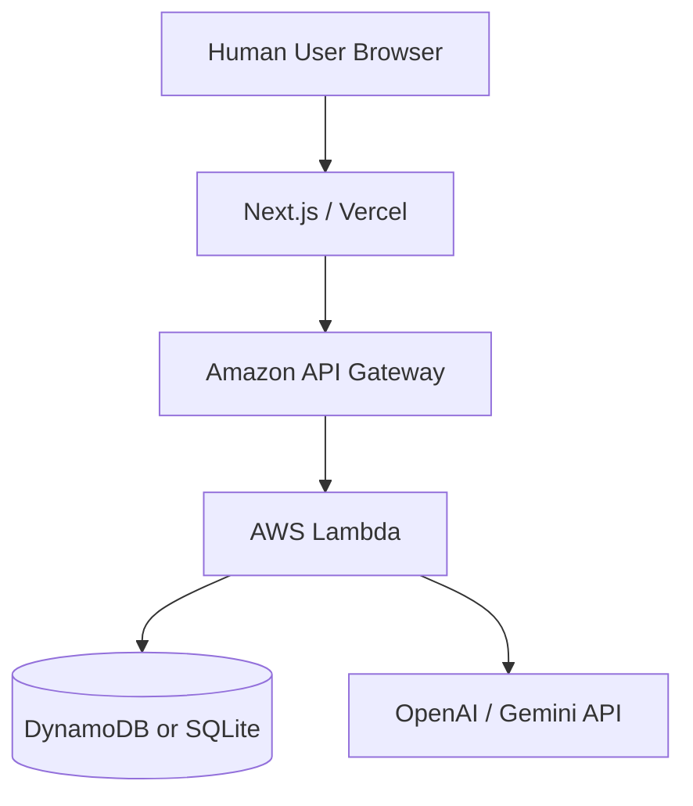

# システムアーキテクチャ設計 (Electric Chair Arena)

## 1. 構成概要
本システムは React (Next.js) をフロントエンドに、AWS Lambda と DynamoDB（または SQLite）をバックエンドに使用したサーバーレスアーキテクチャで構成される。インフラ管理には Serverless Framework を使用する。

## 2. 技術スタック
- **Frontend**: Next.js (React), TypeScript, Tailwind CSS
- **Backend**: AWS Lambda, API Gateway
- **Database**: DynamoDB (本番) / SQLite (ローカル開発)
- **Infrastructure**: Serverless Framework
- **AI Integration**: OpenAI API / Gemini API (LLM AIモデル) または 確率重みテーブル（強化学習/ヒューリスティックモデル）

## 3. コンポーネント構成

### 3.1 フロントエンド (Next.js)
- **AI選択ロビー**:
  - 対戦するAIモデルの選択、特徴・レーティング・戦績の確認。
- **ゲーム対戦画面**:
  - 1〜12のイスの配置を表現した時計状UI。
  - 人間プレイヤーの「イス選択」「電流設置」アクションの入力と、AIの応答・判定のアニメーション表現。
- **レーティングボード**:
  - 人間との対戦履歴を通じて成長・変化したAIモデルのランキング表示。

### 3.2 バックエンド (AWS Lambda / Game Engine)
- **Game Controller**:
  - 人間とAIモデルが送信した行動（イス選択 / 電流設置）を受け取り、判定・スコア計算・終了判定を行う。
- **AI Decider**:
  - 選択されたAIモデル（ランダム、アグレッシブ、慎重、学習型等）の行動選択ロジック（またはLLM API）を呼び出し、意思決定を返す。
- **Learning & Update Processor**:
  - 対戦終了後、対戦ログ（人間がどの椅子を選び、AIがどこに設置したか等）を基に、そのAIモデルの重みパラメータやELOレーティングを更新し、データベースに保存する。

### 3.3 データベース (DynamoDB / SQLite)
- **Players (AI Models) テーブル**:
  - AIモデルID、モデル名、特徴タイプ、ELOレーティング、勝敗数、モデル固有の学習パラメーター（重みテーブル等）。
- **Matches テーブル**:
  - 対戦ID、プレイヤー（人間）情報、対戦相手AIモデル、最終スコア、感電回数、勝者、詳細なターンログ（JSON形式）。

## 4. インフラ構成図 (イメージ)

## 5. デプロイフロー

### 5.1 ローカル環境でのデプロイ・実行
ローカルで開発・テストを行うための手順は以下の通り。

1. **バックエンド**:
   - `backend` ディレクトリにて、Serverless Offline および DynamoDB Local を利用してローカル環境でAPIとDBを立ち上げる。
   - 必要な依存関係をインストールする: `npm install`
   - ローカル環境を起動する: `npx serverless offline start`
2. **フロントエンド**:
   - `frontend` ディレクトリにて、Next.jsの開発サーバーを立ち上げる。
   - 必要な依存関係をインストールする: `npm install`
   - 開発サーバーを起動する: `npm run dev`
   - ブラウザで `http://localhost:3000` にアクセスし、動作確認を行う。

### 5.2 リモート（本番）環境へのデプロイ
1. **バックエンド**:
   - Serverless Framework (`sls deploy`) により AWS リソース（Lambda, API Gateway, DynamoDB）を構築し、APIエンドポイントを発行する。
2. **フロントエンド**:
   - Vercel, GitHub Pages 等のホスティング環境へデプロイする。
   - デプロイ時に環境変数 (`NEXT_PUBLIC_API_URL`等) でリモートのAPIエンドポイントを指定する。
