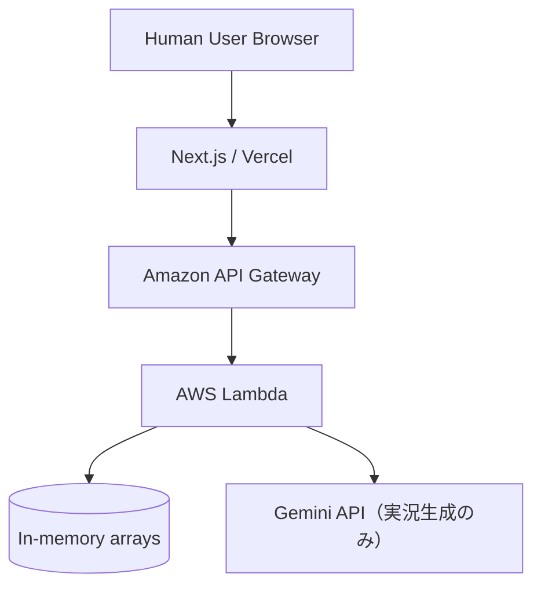

# システムアーキテクチャ設計 (Electric Chair Arena)

## 1. 構成概要
本システムは React (Next.js) をフロントエンドに、AWS Lambda をバックエンドに使用したサーバーレスアーキテクチャで構成される。インフラ管理には Serverless Framework を使用する。

## 2. 技術スタック
- **Frontend**: Next.js (React), TypeScript, Tailwind CSS
- **Backend**: AWS Lambda, API Gateway
- **Database**: 読み取りはLambda プロセス内のインメモリ配列（`backend/handler.js` の `playersDb` / `matchesDb`）を使用。試合終了時（`startMatch` / `saveMatch`）のスコアボードはDynamoDB（`MatchesTable`）へも書き込む（書き込み失敗時もレスポンスはブロックしないベストエフォート方式）。
- **Infrastructure**: Serverless Framework
- **AI Integration**: Gemini API は対戦の実況テキスト生成（`generateCommentary`）にのみ使用。AI自体の行動決定はLLMを使わず、`backend/handler.js` 内のヒューリスティックロジック（個性付きAI3種・ランダムAI・期待値計算AI）と `backend/nash.js` のナッシュ均衡AIで行う。OpenAI APIは使用していない。

## 3. コンポーネント構成

### 3.1 フロントエンド (Next.js)
- **AI選択ロビー**:
  - 対戦するAIモデルの選択、特徴・レーティング・戦績の確認。
  - 人間対AI対戦、人間対人間（ローカルPvP）対戦、リーダーボード、過去のスコアボード一覧への入り口。
- **ゲーム対戦画面**（人間対AI / 人間対人間の2種）:
  - 1〜12のイスの配置を表現した時計状UI。
  - 人間プレイヤーの「イス選択」「電流設置」アクションの入力と、AI（またはもう一方の人間）の応答・判定のアニメーション表現。
- **レーティングボード**:
  - 人間との対戦履歴を通じて変化したAIモデルのランキング表示。
- **過去のスコアボード一覧**:
  - 保存済みの対戦結果を一覧表示する画面。

### 3.2 バックエンド (AWS Lambda / Game Engine)
8つのLambda関数（`backend/serverless.yml`）で構成される。
- **getPlayers / getLeaderboard**:
  - AIモデル一覧、レーティング順のランキングを返す。
- **startMatch / saveMatch**:
  - 対戦の作成、終了後の結果保存とELOレーティング更新（勝敗数・対戦数の加算を含む）。
- **getMatches / getMatchResult**:
  - 保存済み対戦の一覧・詳細取得。
- **getAiMove**:
  - 選択されたAIモデル（個性AI3種、ランダムAI、期待値計算AI、ナッシュ均衡AI）の行動選択ロジックを呼び出し、椅子選択/電流設置の意思決定と寸劇調の理由付きセリフを返す。
- **generateCommentary**:
  - Gemini API を呼び出し、対戦の実況テキストを生成する（`GEMINI_API` 未設定時はモック文言を返す）。

学習パラメータ（重みテーブル）の更新機構は実装されていない。AIの「成長」は対戦結果に応じたELOレーティングの加減算のみ。

### 3.3 データベース（インメモリ）
- **Players (AI Models)**:
  - AIモデルID、モデル名、タイプ（`personality` / `random` / `rule_based` / `nash`）、ELOレーティング、勝利数、対戦数。
- **Matches**:
  - 対戦ID、プレイヤー（人間 or AI）情報、最終スコア、感電回数、勝者、レーティング差分、詳細なターンログ、作成日時。

いずれもLambdaプロセスのメモリ上の配列であり、永続化・複数インスタンス間の共有は行われない（コールドスタートやデプロイで初期データにリセットされる）。

## 4. インフラ構成図 (イメージ)

## 5. デプロイフロー

### 5.1 ローカル環境でのデプロイ・実行
ローカルで開発・テストを行うための手順は以下の通り。

1. **バックエンド**:
   - `backend` ディレクトリにて、Serverless Offline および DynamoDB Local を利用してローカル環境でAPIとDBを立ち上げる。
   - 必要な依存関係をインストールする: `npm install`
   - ローカル環境を起動する: `npx serverless offline start`
2. **フロントエンド**:
   - `frontend` ディレクトリにて、Next.jsの開発サーバーを立ち上げる。
   - 必要な依存関係をインストールする: `npm install`
   - 開発サーバーを起動する: `npm run dev`
   - ブラウザで `http://localhost:3000` にアクセスし、動作確認を行う。

### 5.2 リモート（本番）環境へのデプロイ
1. **バックエンド**:
   - Serverless Framework (`sls deploy`) により AWS リソース（Lambda, API Gateway, DynamoDB）を構築し、APIエンドポイントを発行する。
2. **フロントエンド**:
   - Vercel, GitHub Pages 等のホスティング環境へデプロイする。
   - デプロイ時に環境変数 (`NEXT_PUBLIC_API_URL`等) でリモートのAPIエンドポイントを指定する。
