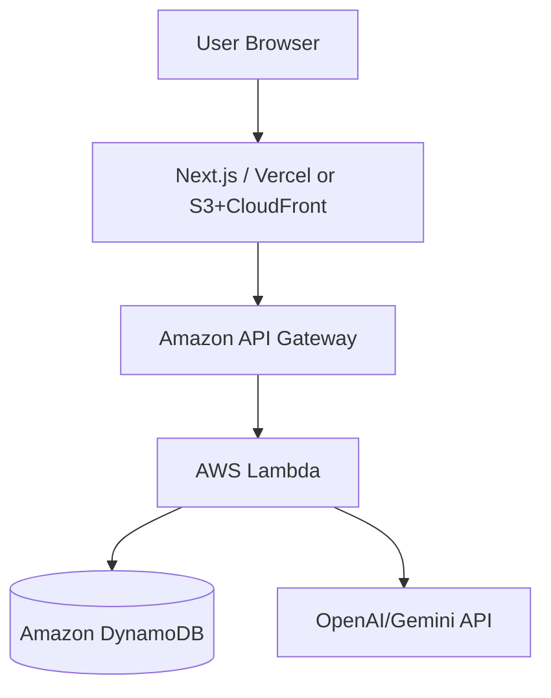

# システムアーキテクチャ設計

## 1. 構成概要
本システムは React (Next.js) をフロントエンドに、AWS Lambda と DynamoDB をバックエンドに使用したサーバーレスアーキテクチャで構成される。インフラ管理には Serverless Framework を使用する。

## 2. 技術スタック
- **Frontend**: Next.js (React), TypeScript, Tailwind CSS
- **Backend**: AWS Lambda, API Gateway
- **Database**: DynamoDB
- **Infrastructure**: Serverless Framework
- **AI Integration**: OpenAI API / Gemini API (将来)

## 3. コンポーネント構成

### 3.1 フロントエンド (Next.js)
- 捺印キャンバス：ドラッグ＆ドロップ、回転などの操作
- ステージ管理：現在の進捗保存、画面遷移
- 判定結果表示：差し戻し理由や合格通知の表示

### 3.2 バックエンド (AWS Lambda)
- `judgeHanko`: 捺印の位置・角度等を受け取り、ステージごとのルールに基づき合否を判定する
- `getStage`: 現在のステージ情報、必要とされるマナー（ルール）を取得する
- `updateProgress`: ユーザーの進捗を保存する

### 3.3 データベース (DynamoDB)
- `Users`: ユーザーID、現在のステージ、トータルスコア
- `Stages`: ステージID、タイトル、判定基準、差し戻しメッセージ集

## 4. インフラ構成図 (イメージ)

## 5. デプロイフロー
1. Serverless Framework (`sls deploy`) により AWS リソース（Lambda, API Gateway, DynamoDB）を構築。
2. フロントエンドは別途ホスティング環境（Vercel推奨）へデプロイ。
